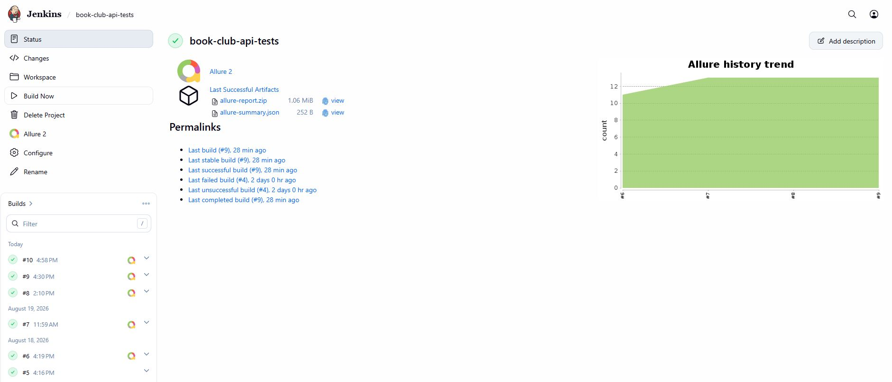
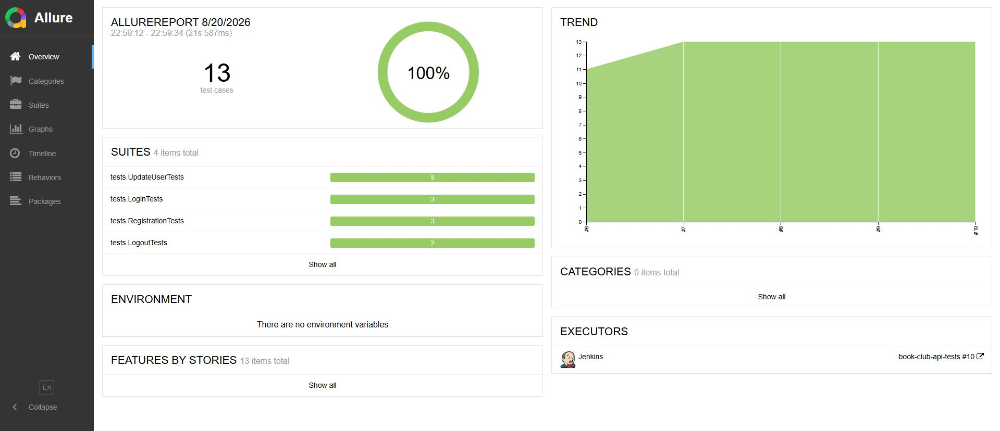

# API Autotests for Book Club

This project is designed to automate API testing of the **Book Club** service.

## Test Coverage

The project includes automated API tests for:

- user registration;
- user login;
- user logout;
- getting current user information;
- updating user information using PUT;
- updating user information using PATCH;
- deleting current user;
- negative validation scenarios.

## Technologies

- Java
- Gradle
- JUnit 5
- REST Assured
- Lombok
- AssertJ
- Allure Report
- Allure REST Assured
- JSON Schema Validation
- Datafaker

## Running the Tests

The following command is used to run the tests locally:

```bash
./gradlew clean test
```

## Remote Test Execution in Jenkins

The project is configured for automated test execution in Jenkins.



The following command is used to run the tests in Jenkins:

```bash
clean test
```

## Integrations

### Allure Report

Allure Report is used to display API test execution results, test steps, requests and responses.



## Repository

GitHub repository:  
https://github.com/tumenbaevaj/book-club-api-tests