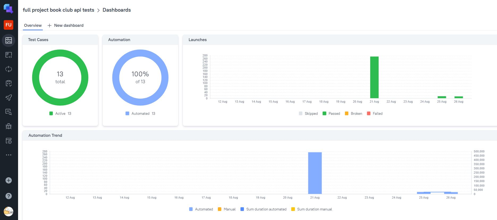
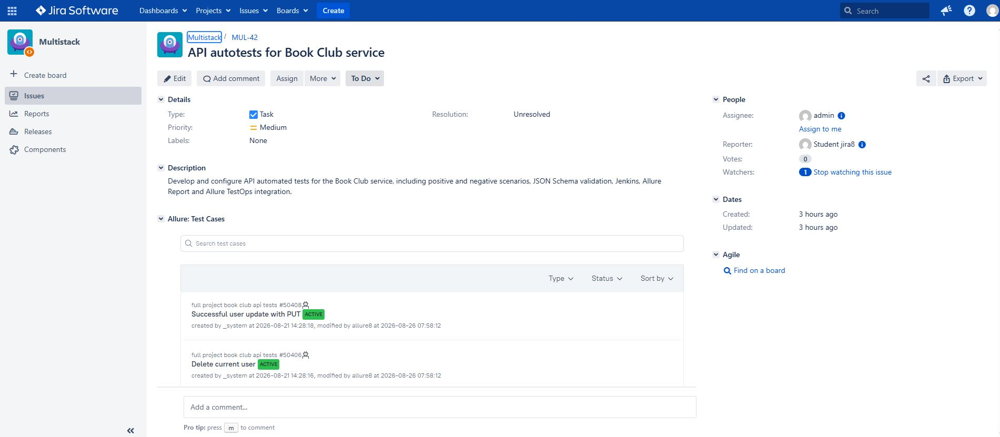
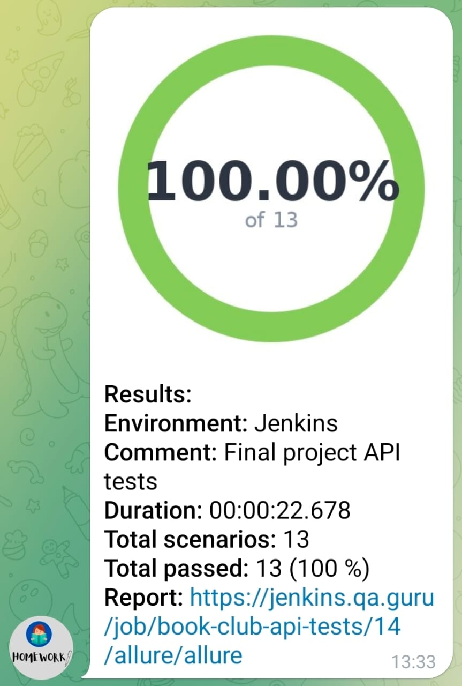

# API Autotests for Book Club

<p align="center">
  
</p>

This project is designed to automate API testing of the **Book Club REST API** service.

## Test Coverage

The project includes **13 automated API tests**:

### Positive Scenarios

1. Successful user registration
2. Successful user login
3. Successful user logout
4. Get current user
5. Successful user update with PUT
6. Successful user update with PATCH
7. Delete current user

### Negative Scenarios

8. Registration of an existing user
9. Registration with blank username
10. Login with wrong credentials
11. Login with blank password
12. Logout with blank refresh token
13. User update with invalid PUT data

## Technologies

<p align="center">
  
  
  
  
  
  
  
  
  
</p>

<p align="center">
  
  
  
  
  
  
</p>

## Running the Tests

The following command is used to run the tests locally:

```bash
./gradlew clean test
```

## Remote Test Execution in Jenkins

The project is configured for automated API test execution in **Jenkins**.

### [Open Jenkins Job](https://jenkins.qa.guru/job/book-club-api-tests/)

The following command is used to run the tests in Jenkins:

```bash
clean test
```

An example of a successful Jenkins build:


## Integrations

### [Allure Report](https://jenkins.qa.guru/job/book-club-api-tests/40/allure/)

Allure Report is used to visualize API test execution results.

The report contains:

- test execution status;
- test steps;
- API requests;
- API responses;
- execution history.


### [Allure TestOps](https://allure.qa.guru/project/5356/dashboards)

Test execution results are sent from Jenkins to **Allure TestOps**.

Allure TestOps is used for:

- automated test case management;
- launch history;
- execution results;
- test steps;
- test automation statistics;
- Jira integration.

The project contains **13 automated API test cases**.



### [Jira](https://jira.qa.guru/browse/MUL-42)

The following Jira issue was created for the project:

**MUL-42 — API autotests for Book Club service**

The Jira issue describes the API automation project and its integrations with Jenkins, Allure Report and Allure TestOps.



## Telegram Notifications

Telegram notifications are configured to send test execution results and a link to the Allure Report after the Jenkins build.

An example of a successful notification with **13 of 13 API scenarios passed** is shown below:



Due to network restrictions in the Jenkins environment, connection to the Telegram API may occasionally be unavailable.

## Repository

### [GitHub Repository](https://github.com/tumenbaevaj/book-club-api-tests)